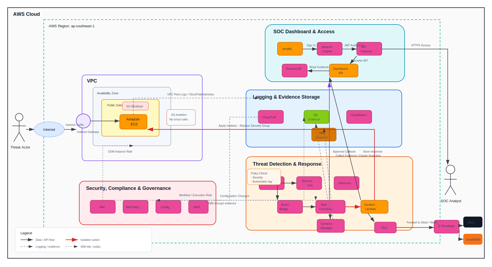

# TRANTHAINGUYEN-fcj-internship-report

Báo cáo thực tập FCJ — Trần Thái Nguyên

**Sinh viên:** Trần Thái Nguyên · HUTECH · An ninh mạng · 22DTHB1  
**Chương trình:** First Cloud Journey Workforce Bootcamp — Amazon Web Services Viet Nam  
**Thời gian:** 09/05/2026 – 10/08/2026

## Demo

Xem báo cáo online tại:

```
https://tranthainguyendevdeveloper117-gocoder.github.io/Tran-Thai-Nguyen-fcj-internship-report/vi/
```

## Tổng quan

Đây là website báo cáo thực tập FCJ, ghi lại hành trình học tập, thực hành AWS và xây dựng dự án **AWS CloudSOC** trong chương trình First Cloud Journey Workforce Bootcamp. Nội dung tập trung vào worklog 12 tuần, proposal, blog kỹ thuật, sự kiện đã tham gia, workshop thực hành, phần tự đánh giá và feedback sau chương trình.

## Preview



## Điểm nổi bật

- Trình bày song ngữ Anh/Việt bằng Hugo.
- Tổng hợp worklog thực tập theo từng tuần.
- Xây dựng proposal dự án **AWS CloudSOC** theo hướng phát hiện, điều tra và phản ứng sự cố trên AWS.
- Có workshop hướng dẫn vẽ sơ đồ kiến trúc CloudSOC bằng draw.io/diagrams.net.
- Bổ sung blog, sự kiện, self-evaluation và feedback để thể hiện đầy đủ quá trình học tập.

## What I Learned

Through this internship report, I practiced building a complete technical portfolio with Hugo and GitHub Pages. I learned how to document AWS learning progress, design a CloudSOC architecture, explain security workflows, organize bilingual technical content, and present project outcomes in a clear and professional way.

## Cấu trúc

| Mục | Nội dung |
|-----|----------|
| 1. Worklog | Nhật ký công việc 12 tuần |
| 2. Proposal | Bản đề xuất dự án |
| 3. Blogs | Bài viết AWS Study Group |
| 4. Events | Sự kiện đã tham gia |
| 5. Workshop | Lab AWS workshop |
| 6. Self-evaluation | Tự đánh giá |
| 7. Feedback | Chia sẻ & feedback |

## Chạy local

Mở PowerShell, vào đúng thư mục chứa source Hugo:

```powershell
cd "C:\Users\Lenovo\Downloads\TRANTHAINGUYEN-fcj-internship-report"
hugo server -D -p 3655 --disableFastRender
```

Sau đó mở trình duyệt:

```text
http://localhost:3655/vi/
```

Hoặc chạy nhanh bằng file có sẵn:

```powershell
.\serve.bat
```

Nếu Hugo báo port đang được sử dụng, dừng tiến trình Hugo cũ rồi chạy lại:

```powershell
Get-Process hugo -ErrorAction SilentlyContinue | Stop-Process -Force
hugo server -D -p 3655 --disableFastRender
```

Nếu muốn build bản tĩnh để kiểm tra trước khi deploy:

```powershell
hugo
```

## Deploy

Push lên nhánh `main` → GitHub Actions tự build và deploy lên `gh-pages`.

Chi tiết: xem [HUONG-DAN-DEPLOY.md](HUONG-DAN-DEPLOY.md)
